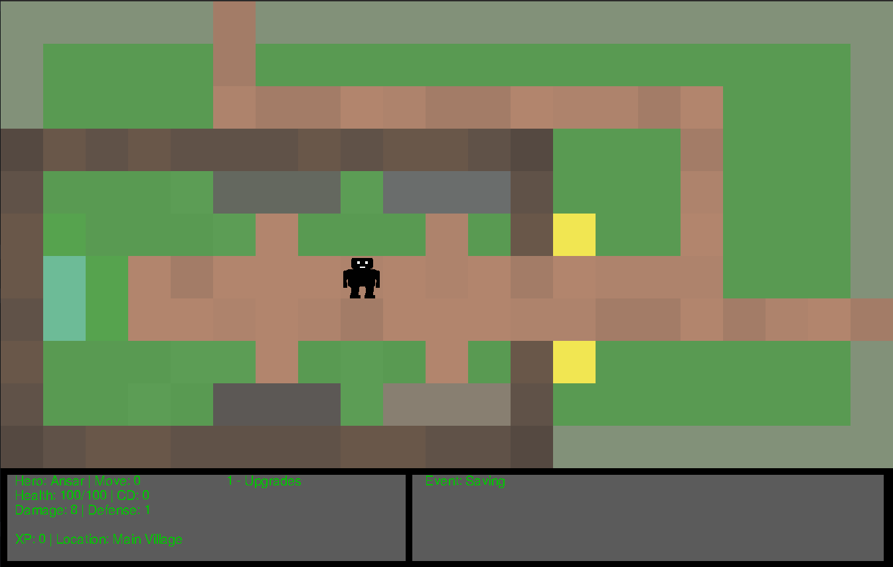
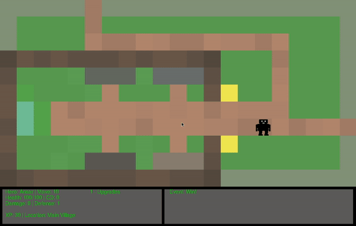
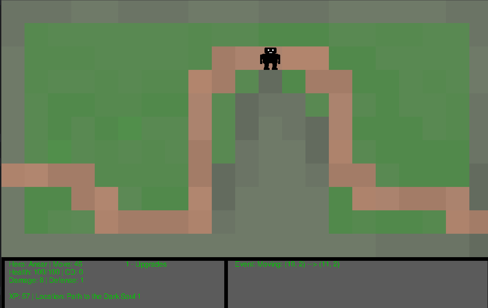
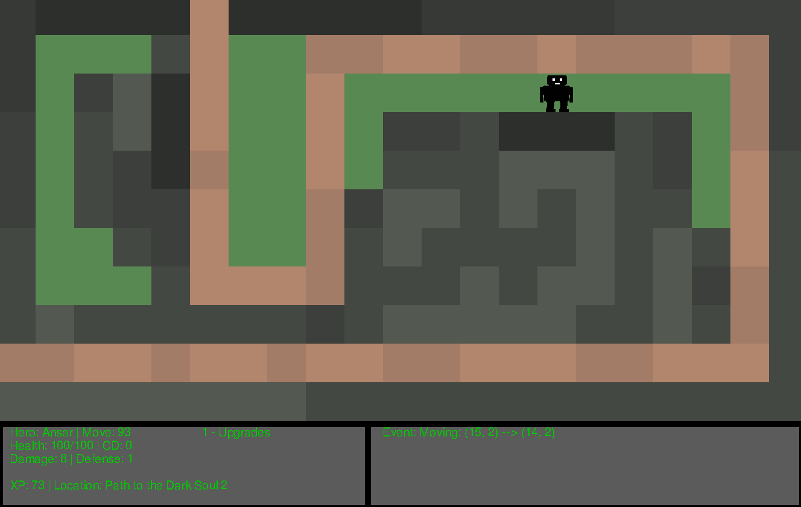
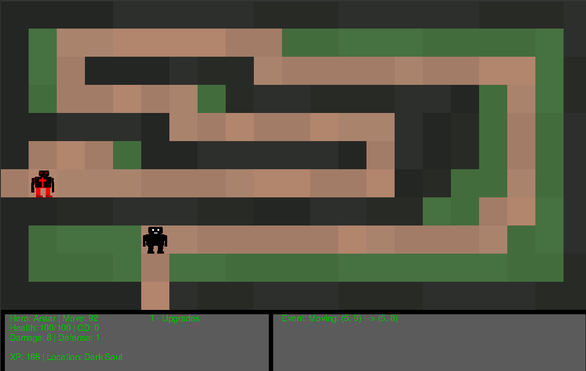
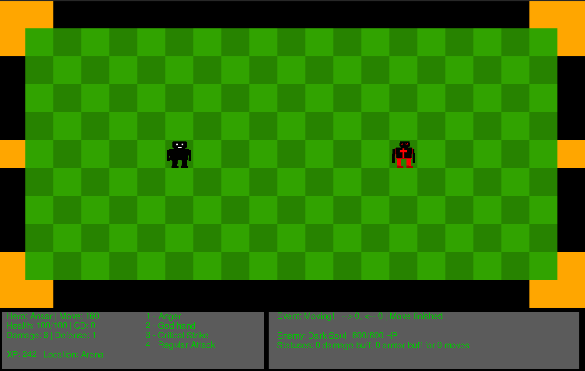
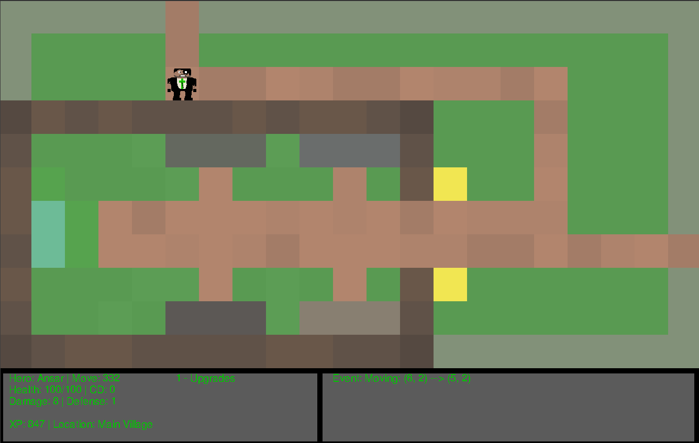
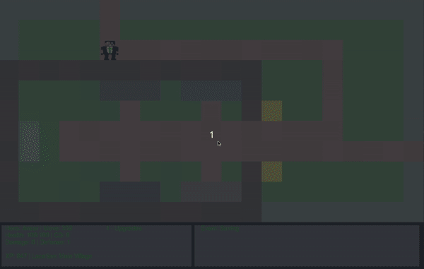
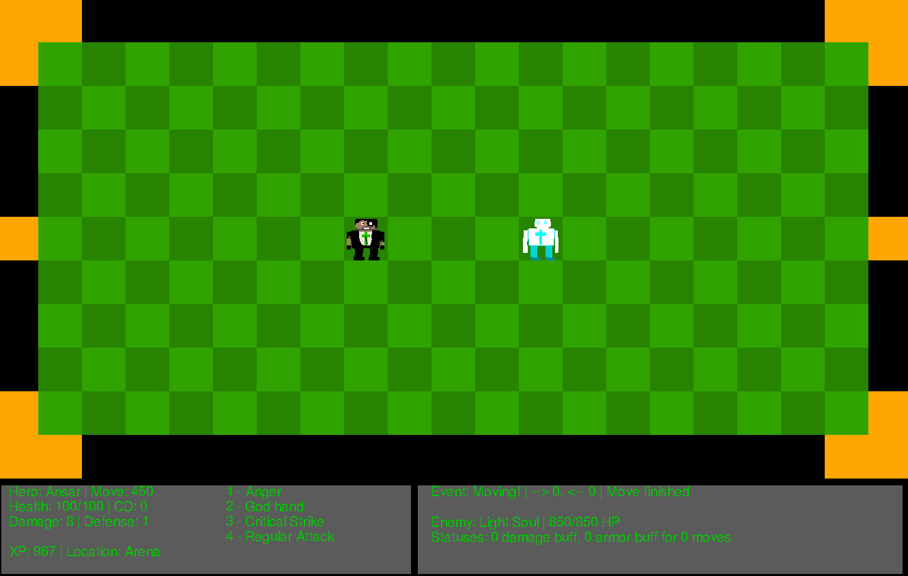
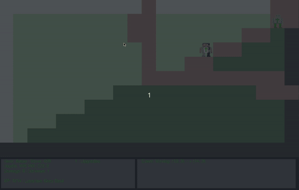

# Save Your Princess

A simple rogue-like game

> This was the project for "Algorithms and Programming" course in SDU (Almaty/Kazakhstan) university. (2018)

Main purposes:

- Test my basic python knowledge
- Experience game dev via pygame

## Gameplay

- You're playing as a hero that has lost his own soul
- The goal is, to save princess and also retrieve your soul back from the demons
- To finish this, you need to fight 4 bosses: light soul, dark soul, gray soul, soul king
- In the beginning, you aren't strong enough to defeat all the demons, therefore there's a bunch of random souls from whose you can become a true hero

- While fighting, you have 4 active skills: 1 healing, 2 damage/armor buff, 3 critical hit, 4 ordinary hit

Good Luck!

P.S. There's a cheat code to defeat all the creatures instantly, just press 0 while fighting

## Playthrough

> I will use cheat code to play much faster

First, we end up in the home location

From there, we are free to go beat first Light-Soul or Dark-Soul, for me it was Dark-Soul, so let's go find him.

While you move, you may fight random encounters (inspired by Final Fantasy) to get experience and therefore upgrade yourself

Arena fights looks like this:

We go right from the home location and passing few other locations

Path to Dark-Soul 1:

Path to Dark-Soul 2:

Dark soul itself:

And finally we got to fight him!

After defeating the Dark-Soul, we return the part of our soul so, the player model will look differently. Now we need to go back to the home location and head over the Light-Soul.

Home location again

Moving to Light-Soul

And finally, we fight Light-Soul

After defeating two of them, the central location is open for us, we can go there and defeat Gray-Soul.

After defeating Gray-Soul the only location is left is the princess, Soul-King and you.

> The game isn't balanced well, so this final fight (if you're playing without cheats) is a tough one

And you won!
